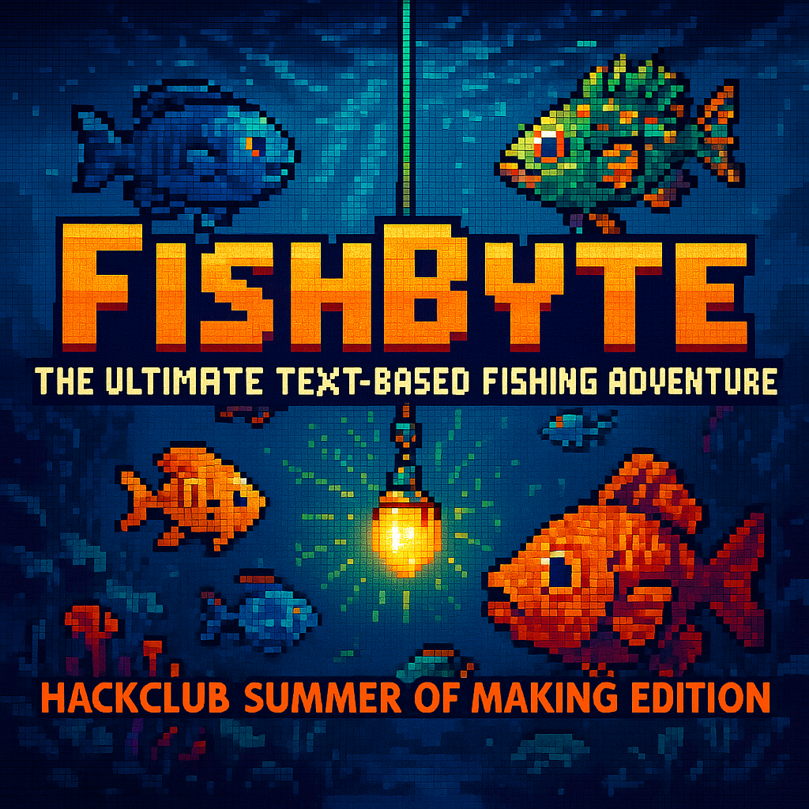

# 🎣 FishByte - The Ultimate Text-Based Fishing Adventure
## *HackClub Summer of Making Edition*



## 🚀 **Get Started in Under 2 Minutes!**

Ready to dive into the most addictive fishing game you've ever played? Here's how to get hooked:

### **Quick Setup** ⚡
```bash
# 1. Clone & Go
git clone https://github.com/Papaya-Voldemort/FishByte.git && cd FishByte

# 2. Install & Play
pip install -r requirements.txt && python main.py
```

**macOS Users:** Use `pip3` and `python3` instead!

---

## 🌟 **Why FishByte Will Blow Your Mind**

### **🎮 Pure Nostalgia Meets Modern Gaming**
- Classic text-based RPG experience with a fresh twist
- Handcrafted fish database with AI balanced content
- Authentic passion project by a real fishing enthusiast :)

### **🐟 Massive Fish Collection**
- **Hundreds of unique fish** across multiple locations
- **9 Rarity Tiers:** From Bronze to Ancient Fossil
- **5 Fishing Locations:** Home Pond, River, Lake, Shallow Ocean, Deep Ocean
- **Legendary catches** like Coelacanth and Megalodon await!

### **🛒 Progressive Upgrade System**
- **Shop System:** Upgrade your gear to catch rarer fish
- **Three Rod Tiers:** Basic → Advanced → Elite
- **Strategic Gameplay:** Better equipment = Better catches = More coins

### **🎯 Perfect for Everyone**
- **New Players:** Built-in tutorial gets you fishing in minutes
- **Hardcore Gamers:** Deep progression and rare fish hunting
- **Casual Players:** Pick up and play whenever you want

---

## 🏆 **What Players Are Saying**

> *"I thought I'd try it for 5 minutes... 3 hours later I'm still hunting for that Diamond Megalodon!"*

> *"The fish database is incredible - you can tell this was made with real passion."*

> *"Best text-based game I've played since the classics!"*

---

## 🎣 **Experience the Adventure**

### **Core Gameplay Loop:**
1. **Cast Your Line** - Fish in 5 unique locations
2. **Catch & Collect** - Build your fish collection
3. **Sell & Upgrade** - Turn catches into better equipment
4. **Hunt Legendaries** - Chase those ultra-rare Ancient Fossil fish
5. **Save & Continue** - Your progress is always saved

### **What Makes FishByte Special:**
- 🎨 **Handcrafted Content:** Every fish personally designed
- 🔄 **Endless Replayability:** Always something rarer to catch
- 💎 **Collector's Dream:** Multiple rarities for every species
- 🌊 **Location Variety:** Each spot has unique fish and challenges

---

## 🚀 **Ready to Start Your Fishing Journey?**

### **System Requirements:**
- Python 3.x
- Git
- 2-5 minutes of your time
- A passion for fishing (or just a love for great games!)

### **Get FishByte Now:**
```bash
git clone https://github.com/Papaya-Voldemort/FishByte.git
cd FishByte
pip install -r requirements.txt
python main.py
```

---

## 🎯 **Join the FishByte Community**

- 🌟 **Star us on GitHub** if you catch something awesome!
- 🐛 **Report bugs** - Help make FishByte even better
- 💡 **Suggest features** - Your ideas shape the future
- 🎣 **Share your legendary catches** - Show off your collection!

---

## 🔮 **The Future of FishByte**

This HackClub Summer of Making edition is just the beginning! We're working toward an exciting future version that will include:
- 🖥️ **Full GUI Version** - Visual fishing experience with stunning graphics
- 🌍 **More Locations** - Expanded world to explore with new fishing spots
- 🎮 **Advanced Features** - Even more ways to play and customize your experience
- 🏆 **Achievements System** - Unlock rewards for your fishing skills
- 🎵 **Enhanced Audio** - Immersive sound effects and music

**Stay tuned for updates as we continue to evolve FishByte into the ultimate fishing game experience!**

---

**Don't just play a fishing game - Experience the fishing adventure that's taking the indie CLI gaming world by storm!**

### **Download FishByte Today and Start Your Legend! 🎣**

---

*FishByte - Where every cast could be your greatest catch.*

---

*Happy fishing!*

---

*Made with love for HackClub Summer of Making 2025*

**Disclaimer:** *This demo page was created with AI assistance for marketing purposes and may contain promotional exaggerations.* 
*While the game features described are real, the testimonials are fictional examples created for demonstration.*


